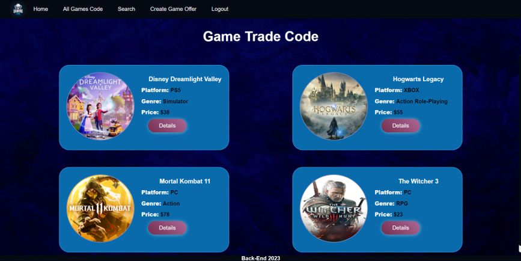
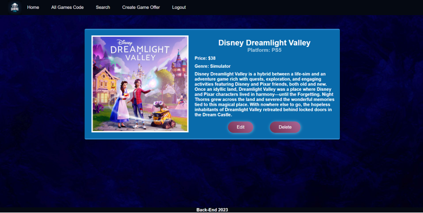

# Gaming-Team

## Overview

This project is designed to practice Node.js skills by building a fully functional game store 🛒 web application. The goal is to integrate front-end structures with back-end logic using JavaScript to create a seamless user experience and a fully operational online game store.

---

## Table of Contents

- [Installation](#installation)
- [Features](#features)
- [Technologies](#technologies)
- [Usage](#usage)

---

## Installation

To set up the project locally, follow these steps:

1. **Clone the repository:**
    ```bash
    https://github.com/MBashov/Gaming-Team.git
    ```

2. **Navigate into the project directory:**
    ```bash
    cd Gaming-Team
    ```

3. **Install dependencies:**
    ```bash
    npm install
    ```

4. **Run the application:**
    ```bash
    npm start
    ```

Your app should now be running locally. Open your browser and visit `http://localhost:5000` to see it in action!

---

## Features

Here are the main features of the Game-Team application:

- **User Authentication**: Users can sign up, log in, and access their personalized content.
- **Authorization**: Certain features are only accessible to authorized users.
- **Game Management**: Users can **add, edit**, and **delete** games from their personal list. Users can also **buy** a game (only if they aren't the owner of the offer).

---

## Technologies

This project utilizes the following technologies:

- **Node.js**: JavaScript runtime for server-side development.
- **MongoDB**: NoSQL database to store game data.
- **Express.js**: Web framework for building the backend server.
- **Handlebars**: Templating engine for rendering dynamic content on the frontend.
- **CSS**: Styles provided by the SoftUni to define the app's UI.
- **HTML**: Structure and layout of the pages, provided by SoftUni.

---

## Usage

After setting up the app, here’s how to use it:

1. **Sign Up / Log In**: Register a new account or log in with an existing one.
2. **Game Management**: Add game offers to your list by providing relevant details such as title and description.
3. **Edit or Delete**: You can update or remove game offers from your list anytime.
4. **Search Functionality**: Easily filter all game offers by name and platform using a case-insensitive search string.

---

## Screenshots



